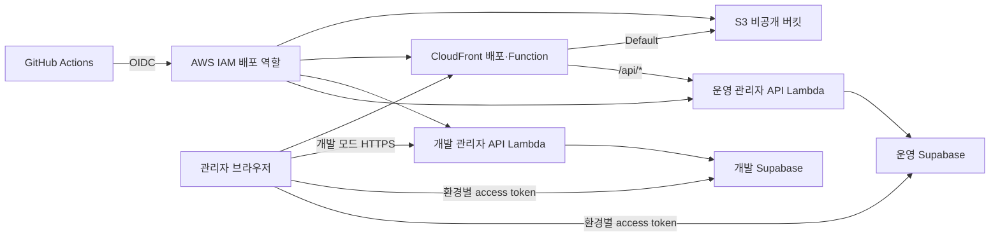

# 액세스 키 없이 Next.js 관리자 콘솔을 GitHub Actions와 AWS에 배포한 과정

> 게시 전 계정 ID, 프로젝트 ref, Lambda Function URL, 실제 사용자 정보와 secret이 스크린샷에 보이지 않는지 다시 확인한다.

## 시작하며

KickON 관리자 콘솔은 Next.js App Router 기반이지만 서버 렌더링이 필요하지 않은 화면은 정적 export로 제공한다. 정적 화면은 S3와 CloudFront에 두고, secret이 필요한 관리자 API만 Lambda로 분리했다. 배포 인증에는 장기 AWS 액세스 키 대신 GitHub Actions OIDC를 사용했다.

최종 구조는 다음과 같다.



## 왜 정적 화면과 관리자 API를 분리했나

Next.js는 `output: "export"`로 빌드하고 `out/`을 S3에 올린다. 브라우저에서 공개되어도 되는 Supabase URL과 publishable key, 환경별 API 주소만 빌드 변수로 넣는다.

서비스 역할 키, Supabase Metrics secret, SportsMonks token, 동기화 secret은 Lambda 환경 변수에만 둔다. 브라우저는 Supabase access token을 `Authorization: Bearer ...`로 보내고, Lambda는 토큰과 활성 관리자 멤버십, 역할 권한을 매 요청마다 다시 확인한다.

이 구조 덕분에 한 정적 콘솔에서 개발과 운영을 전환하면서도 DB와 Lambda secret은 환경별로 분리할 수 있었다.

## AWS 리소스 구성

### S3와 CloudFront

S3 버킷은 공개하지 않고 CloudFront OAC만 접근하게 구성했다. CloudFront에는 두 동작을 둔다.

| 경로 패턴 | 오리진 | 정책 |
| --- | --- | --- |
| `/api/*` | 운영 Lambda Function URL | 캐시 비활성화, 모든 HTTP 메서드, `Authorization` 전달 |
| `Default (*)` | 비공개 S3 | 응답의 Cache-Control 준수 |

Lambda Function URL 오리진은 HTTPS 443을 사용한다. `/api/*`에는 `CachingDisabled`와 `AllViewerExceptHostHeader`를 적용해 인증 헤더는 전달하고 Lambda 호스트 헤더는 유지했다.

Next.js 정적 export의 `/users/`, `/squads/detail/` 같은 디렉터리 경로를 S3 객체에 연결하기 위해 viewer-request CloudFront Function을 사용했다. 확장자 없는 경로는 `/index.html`로 바꾸고 `/api/*`는 그대로 둔다.

### 환경별 Lambda

개발과 운영 Lambda는 동일한 번들을 사용하지만 함수와 환경 변수는 분리했다.

```text
Runtime: nodejs22.x
Handler: index.handler
Timeout: 60초 이상
Function URL auth: NONE
Invoke mode: BUFFERED
```

Function URL의 CORS 기능은 끄고 애플리케이션 코드의 `ADMIN_ALLOWED_ORIGINS`에서 허용 origin을 검사했다. 필요한 런타임 변수는 다음과 같다.

```text
NEXT_PUBLIC_SUPABASE_URL
NEXT_PUBLIC_SUPABASE_PUBLISHABLE_KEY
KICKON_ENVIRONMENT
ADMIN_ALLOWED_ORIGINS
FOOTBALL_SYNC_SECRET
SUPABASE_METRICS_SECRET_KEY
SUPABASE_DATABASE_LIMIT_GB
SUPABASE_STORAGE_LIMIT_GB
SPORTSMONKS_API_ALLOWANCE
```

## GitHub OIDC와 IAM

IAM에 `https://token.actions.githubusercontent.com` OIDC 공급자를 만들고 audience를 `sts.amazonaws.com`으로 지정했다. 배포 역할의 신뢰 정책은 저장소와 GitHub Environment `production`으로 제한했다.

이 저장소는 owner ID와 repository ID가 포함된 immutable subject를 발급했다. 실제 CloudTrail 이벤트에서 확인한 형태는 다음과 같다.

```text
repo:<OWNER>@<OWNER_ID>/<REPOSITORY>@<REPOSITORY_ID>:environment:production
```

정확한 subject를 모를 때 wildcard로 넓히는 대신, 실패한 `AssumeRoleWithWebIdentity` CloudTrail 이벤트의 `principalId`와 `userName`을 확인해 신뢰 정책을 맞췄다.

배포 역할에는 대상 리소스만 허용했다.

- S3: 배포 버킷의 list/get/put/delete
- Lambda: 개발·운영 함수의 `UpdateFunctionCode`, `GetFunctionConfiguration`, `GetFunction`
- CloudFront Function: describe/update/publish
- CloudFront 배포: invalidation 생성·조회

`AdministratorAccess`를 붙이면 빨리 해결할 수 있지만 배포 범위 밖의 리소스까지 열리므로 사용하지 않았다.

## GitHub production Environment 변수

`Prod` 브랜치만 배포할 수 있는 `production` Environment를 만들고 공개 구성값을 Variables에 저장했다.

```text
AWS_ACCOUNT_ID
AWS_REGION
AWS_ROLE_TO_ASSUME
AWS_S3_BUCKET
AWS_CLOUDFRONT_DISTRIBUTION_ID
AWS_CLOUDFRONT_FUNCTION_NAME
AWS_DEVELOPMENT_ADMIN_API_LAMBDA_FUNCTION_NAME
AWS_PRODUCTION_ADMIN_API_LAMBDA_FUNCTION_NAME
ADMIN_SITE_URL

NEXT_PUBLIC_KICKON_DEVELOPMENT_SUPABASE_URL
NEXT_PUBLIC_KICKON_DEVELOPMENT_SUPABASE_PUBLISHABLE_KEY
NEXT_PUBLIC_KICKON_PRODUCTION_SUPABASE_URL
NEXT_PUBLIC_KICKON_PRODUCTION_SUPABASE_PUBLISHABLE_KEY
NEXT_PUBLIC_KICKON_DEVELOPMENT_ADMIN_API_BASE_URL
NEXT_PUBLIC_KICKON_PRODUCTION_ADMIN_API_BASE_URL
NEXT_PUBLIC_SUPABASE_DATABASE_LIMIT_GB
NEXT_PUBLIC_SUPABASE_STORAGE_LIMIT_GB
NEXT_PUBLIC_SPORTSMONKS_API_ALLOWANCE
NEXT_PUBLIC_ADMIN_SYNC_ENABLED
```

`NEXT_PUBLIC_*` 값은 브라우저 번들에 들어가므로 비밀값으로 취급하지 않는다. 서버 secret은 GitHub에 복사하지 않고 각 Lambda 런타임에 저장했다.

## Actions 워크플로

워크플로는 PR과 `Dev` push에서는 검증만 하고, `Prod` push에서 검증을 다시 통과한 뒤 운영 배포를 실행한다.

1. `npm ci`
2. lint, typecheck, test
3. Next.js static export와 Lambda 번들 빌드
4. GitHub OIDC로 AWS 역할 획득
5. 두 Lambda의 runtime·환경 변수 안전성 검사
6. 개발·운영 Lambda 코드 갱신과 waiter 확인
7. 해시가 있는 `/_next/static/*` 자산을 먼저 업로드
8. HTML과 public 파일 업로드
9. CloudFront Function update·publish
10. CloudFront `/*` invalidation 완료 대기
11. S3 Cache-Control 검증
12. 로그인 HTML과 개발·운영 API 인증 경계 smoke check

정적 파일은 유형에 따라 캐시 정책을 다르게 했다.

```text
/_next/static/*  public,max-age=31536000,immutable
HTML/public      no-cache,max-age=0,must-revalidate
```

새 HTML이 아직 업로드되지 않은 chunk를 참조하지 않도록 해시 자산을 먼저 올린다. 두 번째 S3 sync의 `--delete`에서는 `/_next/static/*`를 제외해 배포 중 열려 있던 이전 탭도 기존 chunk를 계속 받을 수 있게 했다.

## 실제로 만난 오류

### OIDC `AccessDenied`

신뢰 정책은 일반적인 `repo:owner/repository:environment:production`을 사용했지만 실제 토큰은 immutable subject 형식이었다. CloudTrail의 `AssumeRoleWithWebIdentity` 실패 이벤트에서 실제 subject를 확인하고 `StringEquals` 조건을 수정해 해결했다.

### Lambda waiter 권한 부족

`aws lambda wait function-updated-v2`는 내부적으로 `GetFunction`을 호출한다. 배포 정책에 `GetFunctionConfiguration`만 있어 waiter가 실패했다. 대상 두 Lambda ARN에 한정해 `lambda:GetFunction`을 추가했다.

### CloudFront 배포 ID의 `0`과 `O`

배포 ID를 옮겨 적을 때 숫자 `0`과 영문 `O`를 혼동해 invalidation 권한과 변수가 맞지 않았다. 콘솔 링크의 실제 ID를 복사해 IAM ARN과 GitHub Variable을 함께 수정했다.

### CloudFront Function 503

Function update와 publish는 성공했지만 모든 요청이 `FunctionExecutionError` 503을 반환했다. Runtime 2.0이 일부 최신 JavaScript 문법만 지원하는데 코드에 optional catch binding(`catch {}`)이 있었다. `catch (error)`로 바꾼 뒤 정상화됐다.

### `index.txt`가 사용자 ID가 된 문제

Next.js 정적 export는 클라이언트 탐색에 `/users/index.txt` 같은 payload를 사용한다. 기존 URL 호환 리디렉션의 정규식이 `index.txt`를 사용자 ID로 판단해 `/users/detail/?userId=index.txt`로 보냈다. 상세 ID 후보에 점이 있으면 리디렉션하지 않도록 고치고 회귀 테스트를 추가했다.

### 개발 DB의 선수 수정 RPC 누락

화면과 읽기는 정상이었지만 개발 환경의 선수 저장만 실패했다. DB를 조회해 `manual_overrides`와 일정 RPC는 있고 `admin_update_player_details`만 없음을 확인했다. 수동 SQL을 정식 migration으로 승격해 개발 DB에 적용하고, `90→91→90` 수정·원복과 감사 로그까지 검증했다.

## 배포 후 확인 항목

- `/login/`이 HTTP 200인가
- 대시보드에서 개발·운영 데이터가 서로 다른가
- DB·Storage·SportsMonks 사용량이 `확인 필요`가 아닌 실제 값인가
- 사용자/문의/선수/일정/순위/데이터 관리 화면이 오류 없이 로드되는가
- 상세 화면에서 메뉴 이동 시 `index.txt`가 주소에 노출되지 않는가
- 선수 수정 후 값과 업데이트 시각이 바뀌고 감사 로그가 남는가
- 원복 후 원래 값으로 돌아오는가
- 토큰 없는 개발·운영 API 요청이 401을 반환하는가

## 마치며

이번 구성에서 가장 중요했던 점은 배포 성공 표시와 서비스 정상 동작을 분리해서 확인한 것이다. OIDC 인증, Lambda 배포, S3 업로드가 모두 성공해도 CloudFront Function이나 Next.js 정적 탐색 payload 때문에 실제 화면은 실패할 수 있다. 그래서 Actions의 smoke check와 로그인된 브라우저의 개발·운영 E2E 확인을 함께 두었다.

관련 구현은 `.github/workflows/deploy.yml`, `infrastructure/cloudfront/viewer-request.js`, `server/admin-api/lambda.ts`, `supabase/migrations/`에서 확인할 수 있다.

